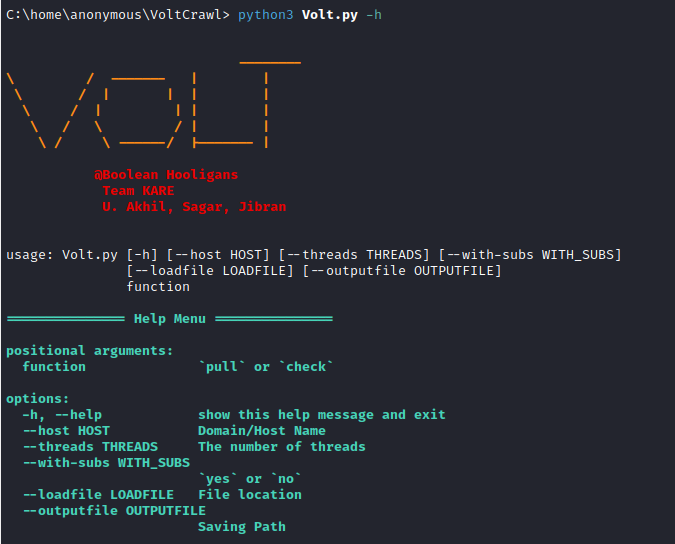

<h4 align="center">Collect XSS vulnerable parameters from entire domain.</h4>

<br>


Volt is An Intelligent Automated tool used to collect every vulnerable parameters via Wayback Machine.


### Main Features
- Find XSS vulnerable patameters.
- Crawl entire website and collect every URL
- Advance Error Handling.
- Collect GET parameters.


`This Framework Also crawl URLs and JS Files for sensitive information.`

<br>

### Installation

```bash
git clone https://www.github.com/jibranwani/Volt
cd VoltCrawl
pip install -r requirements.txt
python3 Volt.py -h
```

### usage
```bash
python3 Volt.py -d pull --host example.com
```


<br>


#### Available command line options

```bash
=============== Help Menu ===============

positional arguments:
  function              `pull` or `check`

options:
  -h, --help                 show this help message and exit
  --host HOST                 Domain/Host Name
  --threads THREADS           The number of threads
  --with-subs WITH_SUBS       `yes` or `no`
  --loadfile LOADFILE         File location
  --outputfile OUTPUTFILE     Saving Path
```
